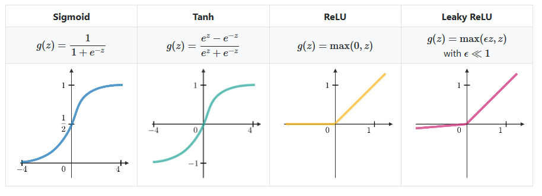
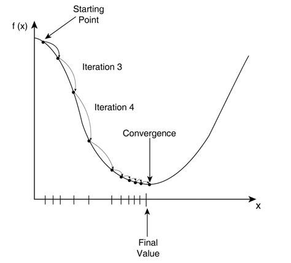
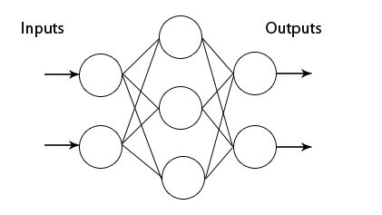

# Deep Learning Using Tensorflow
TensorFlow, as the name indicates, is a framework to define and run computations involving tensors. A tensor is a generalization of vectors and matrices to potentially higher dimensions. Internally, TensorFlow represents tensors as n-dimensional arrays of base datatypes.

Deep learning is an area of machine learning focus on using deep which contains more than one hidden layer artificial neural networks, which are inspired by the human brain.Deep learning is applicable over a range of fields such as computer vision, speech recognition, natural language processing.

**_Activation Function_**
Activation functions are used at the end of a hidden unit to introduce non-linear complexities to the model. Here are the most common ones:

**_Backpropagation_**
Backpropagation is a training algorithm used for a multilayer neural networks. It moves the error information from the end of the network to all the weights inside the network and thus allows for efficient computation of the gradient.
The backpropagation algorithm can be divided into several steps:
1. Forward propagation of training data through the network in order to generate output.
2. Use target value and output value to compute error derivative with respect to output activations.
3. Backpropagate to compute the derivative of the error with respect to output activations in the previous layer and continue for all hidden layers.
4. Use the previously calculated derivatives for output and all hidden layers to calculate the error derivative with respect to weights.
5. Update the weights.

**_Learning Rate_**
The learning rate, often noted α or sometimes η indicates at which pace the weights get updated. This can be fixed or adaptively changed. The current most popular method is called Adam, which is a method that adapts the learning rate.

**_Cost Function_**
Cost functions are used to minimize the errors to improve the accuracy of the model. The model improves the training accuracy by minimising the errors using cost functions. There are many cost functions available such as MeanSquareError,MeanAbsoluteError,cross-entropy etc.

**_Gradient Descent_**
Gradient descent is an optimization algorithm used in machine learning to learn values of parameters that minimize the cost function. It’s an iterative algorithm, in every iteration, we compute the gradient of the cost function with respect to each parameter and update the parameters of the function.

_Stochastic Gradient Descent_
Uses only single training example to calculate the gradient and update parameters.

_Batch Gradient Descent_
Calculate the gradients for the whole dataset and perform just one update at each iteration.

_Mini-batch Gradient Descent_
Mini-batch gradient is a variation of stochastic gradient descent where instead of single training example, mini-batch of samples is used. It’s one of the most popular optimization algorithms.  

**_Artificial Neural Networks_**
ANN are usually inspired from the human brain.A perceptron is nothing but a biological neuron.Perceptron can have two output values 0 or 1.A single layer perceptron will have no hiden layers.Multilayer perceptron will have hidden layers like in the figure shown below.

ANN are generally feed forward networks.

**_Convolution Neural Networks_**
A Convolutional Neural Network (ConvNet/CNN) is a Deep Learning algorithm which can take in an input image, assign importance (learnable weights and biases) to various aspects/objects in the image and be able to differentiate one from the other. The pre-processing required in a ConvNet is much lower as compared to other classification algorithms. While in primitive methods filters are hand-engineered, with enough training, ConvNets have the ability to learn these filters/characteristics.
The architecture of a ConvNet is analogous to that of the connectivity pattern of Neurons in the Human Brain and was inspired by the organization of the Visual Cortex. Individual neurons respond to stimuli only in a restricted region of the visual field known as the Receptive Field. A collection of such fields overlap to cover the entire visual area.

The major difference between a traditional Artificial Neural Network (ANN) and CNN is that only the last layer of a CNN is fully connected whereas in ANN, each neuron is connected to every other neurons.

